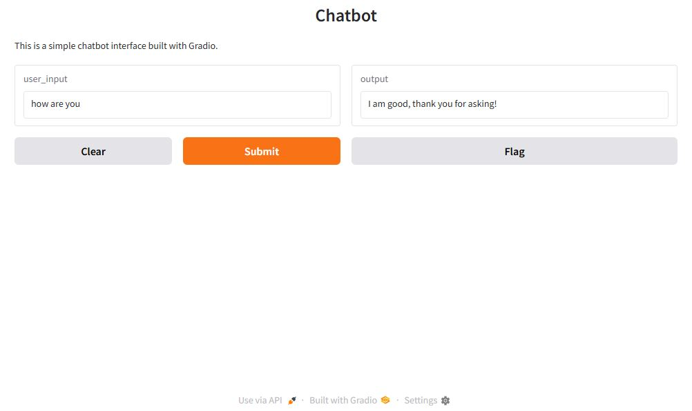

# 🤖 Chatbot with Natural Language Processing (NLP) 🌐

This project is a simple chatbot built using Natural Language Processing (NLP) with the `nltk` library and a web-based GUI using the `Gradio` library. The chatbot can respond to basic user queries and provide simple conversational responses. 💬

## ✨ Features :

- **Text-based chatbot** using regular expression matching for user input. 🔍
- **Web-based interface** using Gradio for easy interaction with the chatbot. 🌐
- **Predefined responses** for common user inputs such as greetings, inquiries, and exit phrases. 👋

## 🛠️ Prerequisites :

Before running the project, ensure you have Python installed and the necessary libraries:

- `nltk` for Natural Language Processing 🧠
- `gradio` for the web-based interface 🌍

### 🏗️ Project Setup :
- Clone the repository or download the project files to your local machine. 📂
```bash
git clone https://github.com/LaithALhaware/Chatbot-with-Natural-Language-Processing.git
cd 'Chatbot-with-Natural-Language-Processing'
```

- Install the dependencies using pip:
```bash
pip install nltk gradio
```

Download necessary NLTK resources:

The `nltk.download('punkt')` in the code will download the necessary resources when you run the project. 🌱

### 🚀 Running the Chatbot on Web Page : 
To start the chatbot, run the Python script:
```bash
python app-GUI.py
```
Once the script is executed, Gradio will open a local web server, and you can access the chatbot by visiting the URL shown in the terminal, usually `http://127.0.0.1:[PORT SHOWING ON CMD]/`. 🔗

### 🚀 Running the Chatbot on CMD :
To start the chatbot, run the Python script:
```bash
python app-CMD.py
```

### 🛠️ How It Works :
- The user inputs a message in the text box. 📝
- The chatbot processes the input and returns an appropriate response based on predefined patterns. 🔄
- Common responses include greetings, checking on the chatbot’s status, and handling unknown inputs. 🤔
- The user can exit the chat by typing `bye` or `exit`. ✋

### 🗣️ Example Interaction : 
`User`: Hi 👋

`Chatbot`: Hello! 🤖


`User`: How are you? 🤔

`Chatbot`: I am good, thank you for asking! 😊


`User`: Bye 👋

`Chatbot`: Goodbye! ✨


### 🎨 Customization :
- You can expand the chatbot's functionality by adding more `patterns` and responses in the patterns list. 📜
- Modify the `respond_to_input()` function to integrate more advanced NLP models or data processing techniques. 🧠
- The `Gradio` interface can also be customized by changing the appearance, layout, and adding additional components like images or files. 🎨


## 📝 License
[[License](LICENSE)] ⚖️


## ❤️ Support This Project
If you find this project useful, consider supporting its development:

💰 Via PayPal: [[PayPal Link](https://www.paypal.com/ncp/payment/KC9EETJDVZQHG)]

Your support helps keep this project alive! 🚀🔥
